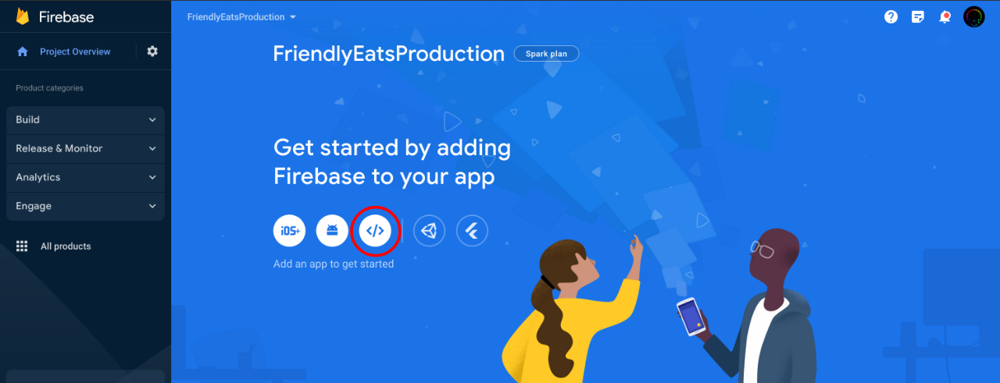
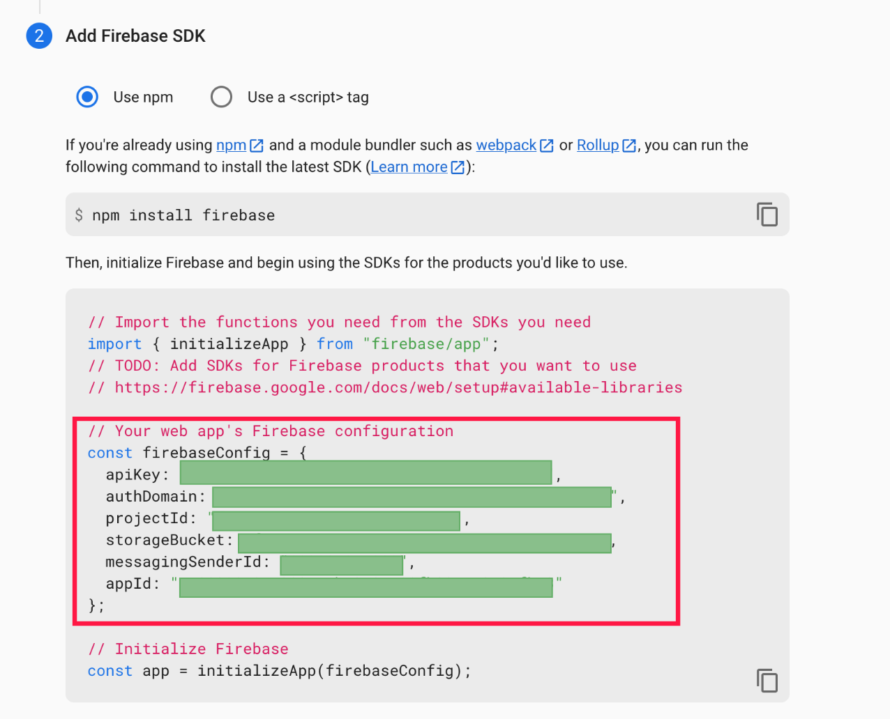
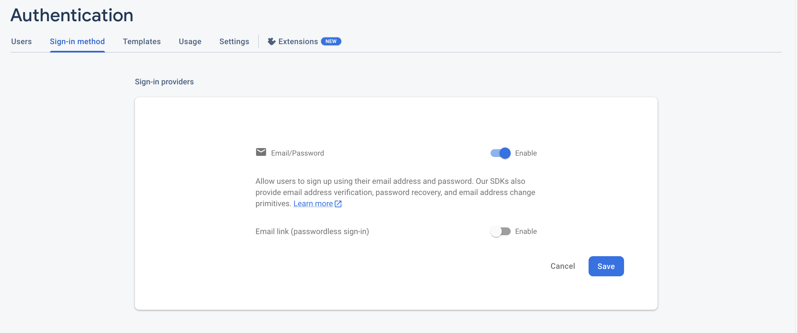
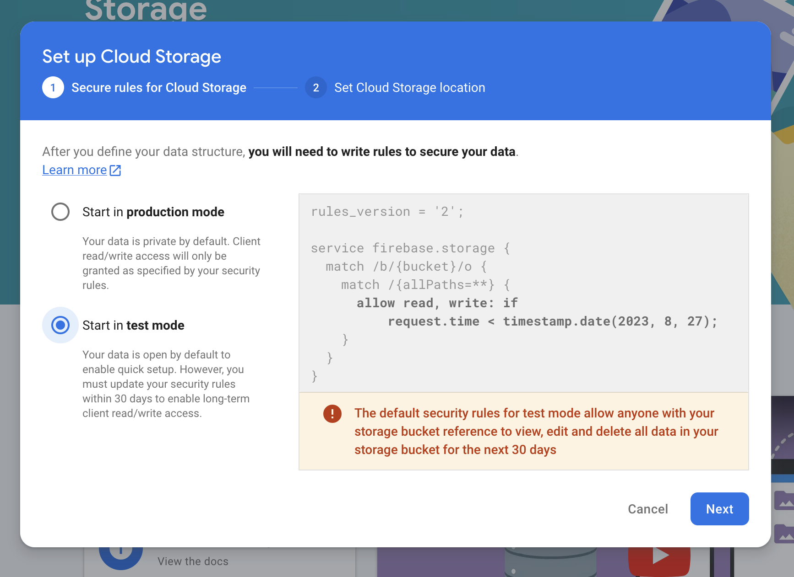

# Firestore Quickstart: Friendly Eats


## Introduction

FriendlyEats is a restaurant recommendation app built on Firestore. It was built with the [Angular](https://angular.io/) Javascript framework, and can make use of [Firebase's Local Emulator Suite](emulator-docs) (specifically, the [Authentication](https://firebase.google.com/docs/emulator-suite/connect_auth), [Storage](https://firebase.google.com/docs/emulator-suite/connect_storage), [Functions](https://firebase.google.com/docs/emulator-suite/connect_functions), and [Firestore](https://firebase.google.com/docs/emulator-suite/connect_firestore) emulators) so that the quickstart can be run without needing to create a project in the [Firebase Console](https://console.firebase.google.com).

For more information about Firestore visit the [Firestore docs][firestore-docs].
For more information about the Firebase Emulator Suite visit the [Emulator Suite docs][emulator-docs]

[firestore-docs]: https://firebase.google.com/docs/firestore/
[emulator-docs]: https://firebase.google.com/docs/emulator-suite

## Prerequisites
Before following the steps to build and run this quickstart you will need:
 1. [Node.Js](https://nodejs.org/en/download) Version 16.0 or higher
 2. [Java](https://jdk.java.net/) JDK version 11 or higher.

## Setup and run the app locally with emulators:

Follow these steps to setup and run the quickstart:

 1. Install the Angular CLI if you do not already have it installed on your machine:
    ``` bash
    npm install -g @angular/cli
    ```

 1. Install the Firebase CLI if you do not have it installed on your machine:
    ```bash
    npm -g i firebase-tools
    ```

 1. Install and build all project dependencies
    ```bash
    npm install && (cd functions && npm install)
    ```

   > **Note:** When modifying the contents of `functions/src`, be sure to run `npm run build` in the `functions/` directory so that Typescript changes can be compiled and present in the next emulator run.

 1. Run and serve the project locally:
    ```bash
    npm start
    ```
 1. Open [http://127.0.0.1:4200](http://127.0.0.1:4200) in your browser and try out the app!

## Configure and run the app with Firebase:

Follow these steps to have a working version of the quickstart hosted and running online with Firebase:

 1. Create a new Firebase project in the [Firebase Console](https://console.firebase.google.com)

 2. On the project homepage, select `Web` under `Get Started By Adding Firebase To Your App` and follow prompts to create your app, making sure to **copy the `firebaseConfig` object** when presented.
 
 

 

 3. With the `firebaseConfig` copied navigate to `src/environments/environments.ts` and paste the contents of the object into the `prod` field:

 

 4. On line 79 of `src/app/app.module.ts`, change your environment from `environments.local` to `environments.prod` in the `provideFirebaseApp` function call
 

 4. Back in the Firebase console, enable email and password authentication on your project by doing: **Authentication > SIGN-IN METHOD > Email > Email/Password > SAVE**

 

 5. In the Firebase console, enable Firestore on your project by clicking **Create Database** in the Cloud Firestore section of the console and answering all prompts.

   1. When prompted, select "Start in Test Mode"

 6. Simmilarly, enable Cloud Storage on your project by clicking **Get Started** in the Storage section of the console and answering all prompts.

   1. When prompted, select "Start in Test Mode"
 

 7. Set the CLI to use the project you created in Step 1:
 ```bash
 firebase --use add
 ```

 8. Deploy the firebase security rules and indexes
 ```bash
 firebase deploy
 ```

 9. Run your angular app locally and see your working app!
 ```bash
 ng serve
 ```


## Support

- [Firebase Support](https://firebase.google.com/support/)

## License

© Google, 2023. Licensed under an [Apache-2](../LICENSE) license.